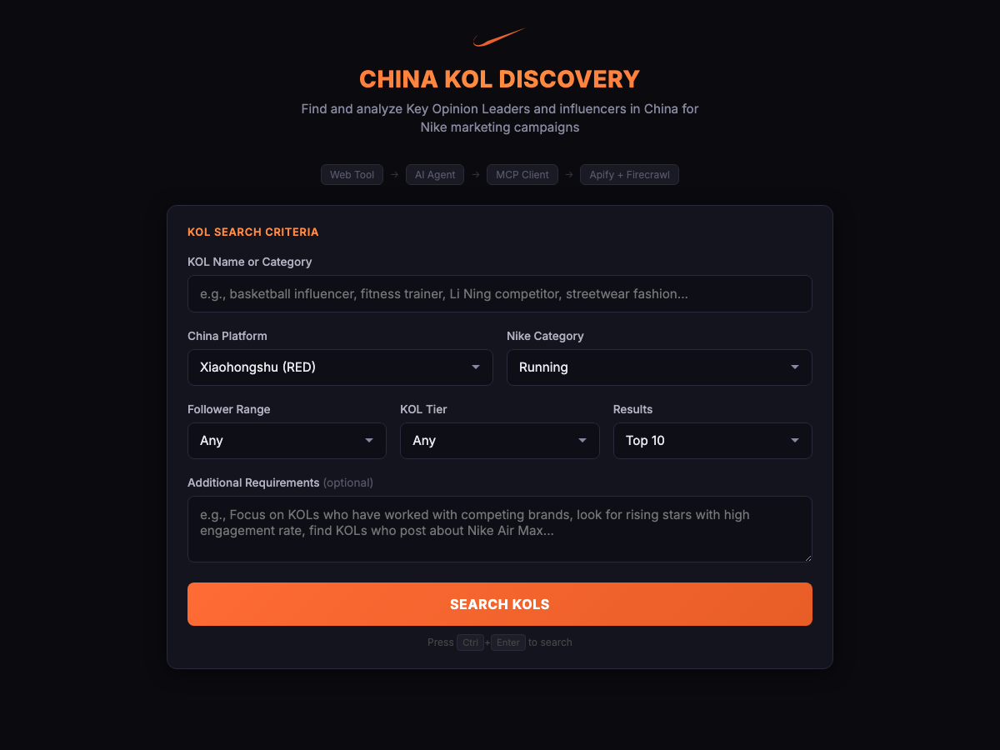

<div align="center">

# Nike China KOL Discovery

[](https://developer.mozilla.org/en-US/docs/Web/HTML)
[](https://developer.mozilla.org/en-US/docs/Web/CSS)
[](https://developer.mozilla.org/en-US/docs/Web/JavaScript)
[](https://n8n.io)
[](https://modelcontextprotocol.io)
[](https://openai.com)

**AI-powered KOL and influencer discovery tool for Nike marketing campaigns in China**

[Live Demo](https://alfredang.github.io/n8nmcp/) · [Report Bug](https://github.com/alfredang/n8nmcp/issues) · [Request Feature](https://github.com/alfredang/n8nmcp/issues)

</div>

## Screenshot



## About

Nike China KOL Discovery is a web-based marketing research tool that leverages AI agents and the Model Context Protocol (MCP) to find and analyze Key Opinion Leaders (KOLs) and influencers in China for Nike marketing campaigns.

The tool connects to an n8n workflow that orchestrates an AI agent with MCP client/server architecture, using Apify for KOL discovery and Firecrawl for deep profile research.

### Key Features

- **China Platform Support** — Search across Xiaohongshu (RED), Douyin, Weibo, WeChat, Bilibili, and Kuaishou
- **Nike Category Filtering** — Filter by Running, Basketball, Streetwear, Sneaker Culture, and more
- **KOL Tier Selection** — Target KOLs, KOCs, Celebrities, or Pro Athletes
- **Follower Range Control** — From Nano (1K-10K) to Mega (1M+)
- **AI-Powered Research** — Uses GPT-5-mini via n8n AI Agent for intelligent KOL analysis
- **MCP Architecture** — Apify (scraping) + Firecrawl (deep research) via MCP protocol
- **Copy to Clipboard** — One-click copy of generated reports
- **Responsive Design** — Works on desktop and mobile

## Tech Stack

| Category | Technology |
|----------|-----------|
| **Frontend** | HTML5, CSS3, JavaScript (Vanilla) |
| **AI Orchestration** | n8n (Workflow Automation) |
| **AI Model** | OpenAI GPT-5-mini |
| **Protocol** | Model Context Protocol (MCP) |
| **Web Scraping** | Apify (RAG Web Browser), Firecrawl |
| **Hosting** | GitHub Pages (Frontend), Hostinger VPS (n8n) |

## Architecture

```
┌─────────────────────────────────────────────────────────┐
│                    Frontend (HTML/JS)                     │
│              Nike China KOL Discovery UI                 │
└──────────────────────┬──────────────────────────────────┘
                       │ POST /webhook
                       ▼
┌─────────────────────────────────────────────────────────┐
│                 n8n: NikeMCPClient                       │
│  ┌──────────┐   ┌───────────┐   ┌───────────────────┐  │
│  │ Webhook  │──▶│ AI Agent  │   │ OpenAI Chat Model │  │
│  │  (POST)  │   │(GPT-5-mini│◀──│                   │  │
│  └──────────┘   └─────┬─────┘   └───────────────────┘  │
│                       │ MCP Client                       │
└───────────────────────┼─────────────────────────────────┘
                        │
                        ▼
┌─────────────────────────────────────────────────────────┐
│                 n8n: NikeMCPServer                       │
│  ┌───────────────────┐   ┌──────────────────────────┐   │
│  │ MCP Server Trigger│   │                          │   │
│  └────────┬──────────┘   │                          │   │
│           │              │                          │   │
│   ┌───────▼───────┐  ┌──▼──────────────────────┐   │   │
│   │  Apify (RAG   │  │  Firecrawl (/scrape)    │   │   │
│   │ Web Browser)  │  │  Deep profile research  │   │   │
│   └───────────────┘  └─────────────────────────┘   │   │
└─────────────────────────────────────────────────────────┘
```

## Project Structure

```
n8nmcp/
├── index.html              # Frontend web application
├── NikeMCPClient.json      # n8n workflow: Webhook + AI Agent + MCP Client
├── NikeMCPServer.json      # n8n workflow: MCP Server + Apify + Firecrawl
├── screenshot.png          # App screenshot
└── README.md               # This file
```

## Getting Started

### Prerequisites

- A running [n8n](https://n8n.io) instance
- OpenAI API key (configured in n8n)
- Apify API key (configured in n8n)
- Firecrawl API key (configured in n8n)

### Setup

1. **Clone the repository**
   ```bash
   git clone https://github.com/alfredang/n8nmcp.git
   cd n8nmcp
   ```

2. **Import n8n workflows**
   - Open your n8n instance
   - Import `NikeMCPServer.json` — activate it first
   - Import `NikeMCPClient.json` — activate it second
   - Configure API credentials (OpenAI, Apify, Firecrawl)

3. **Update webhook URL** (if needed)
   - Edit `index.html` and update `WEBHOOK_URL` to match your n8n instance

4. **Open the app**
   ```bash
   open index.html
   ```
   Or serve locally:
   ```bash
   npx http-server -p 8769 --cors
   ```

## Deployment

### GitHub Pages

The frontend is deployed automatically via GitHub Actions. Push to `main` and the site will be available at:

```
https://alfredang.github.io/n8nmcp/
```

### n8n Backend

The n8n workflows run on a Hostinger VPS. To deploy on your own server:

1. Install n8n: `npm install -g n8n`
2. Import both workflow JSON files
3. Configure credentials for OpenAI, Apify, and Firecrawl
4. Activate both workflows
5. Ensure CORS headers are configured on the webhook node

## Contributing

1. Fork the repository
2. Create your feature branch (`git checkout -b feature/amazing-feature`)
3. Commit your changes (`git commit -m 'Add amazing feature'`)
4. Push to the branch (`git push origin feature/amazing-feature`)
5. Open a Pull Request

## Developed By

**Tertiary Infotech Academy Pte. Ltd.**

## Acknowledgements

- [n8n](https://n8n.io) — Workflow automation platform
- [Model Context Protocol](https://modelcontextprotocol.io) — Open protocol for AI tool integration
- [Apify](https://apify.com) — Web scraping and automation
- [Firecrawl](https://firecrawl.dev) — Web scraping API
- [OpenAI](https://openai.com) — AI language models

---

<div align="center">

If you find this project useful, please give it a star!

</div>
